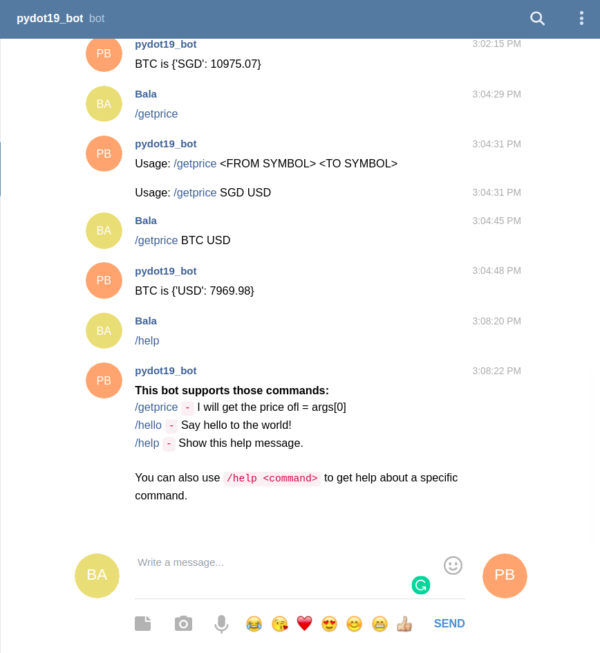

# exchange_rates_telegram_bot


- Update your API_KEYS & TOKENS
```python
TOKEN = "<TELEGRAM_BOT_TOKEN>"
API_KEY = "<API_KEY_FOR_MIN_API>"
```

- Reference for "<TELEGRAM_BOT_TOKEN>"
	- https://www.botogram.dev/docs/0.4/bot-creation/
- Reference for "<API_KEY_FOR_MIN_API>"
	- https://min-api.cryptocompare.com


Output:


